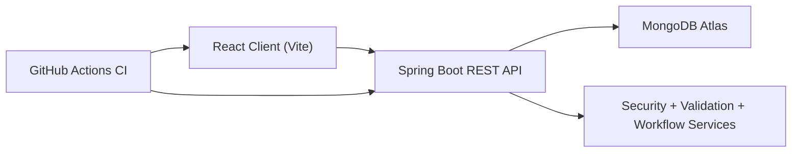
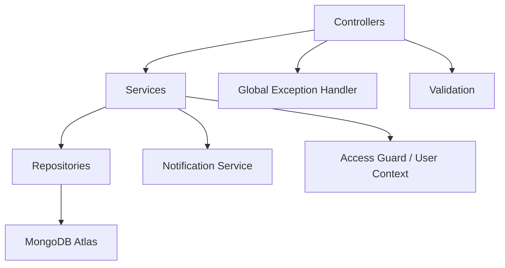
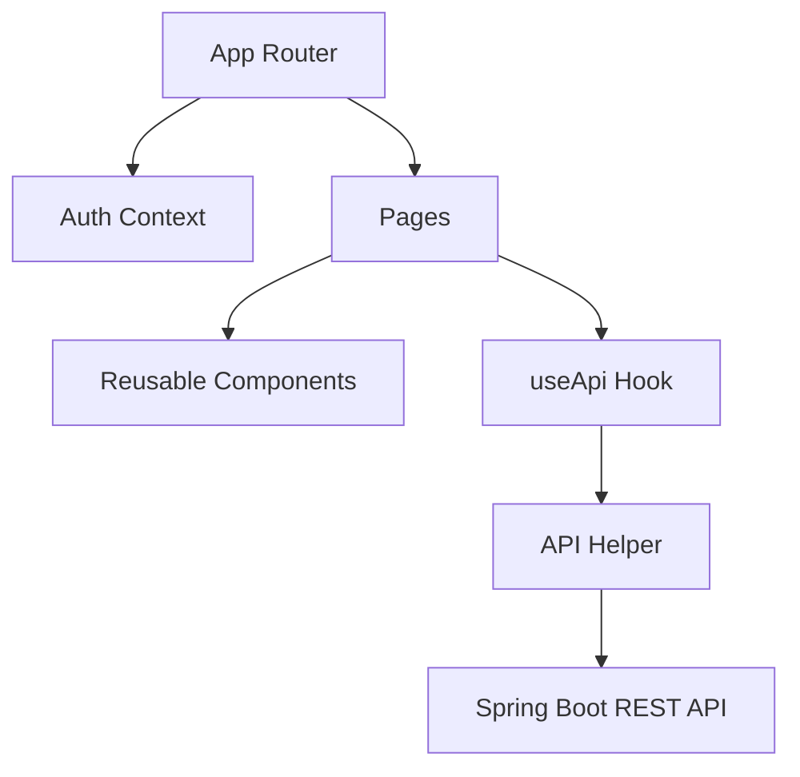

# Architecture

## Overall System

## Backend Architecture

### Layers

- Controllers expose REST endpoints and HTTP status codes.
- Services hold business rules such as booking conflicts and ticket transitions.
- Repositories access MongoDB collections.
- Shared components handle exceptions, validation, and request user identity.

## Frontend Architecture

### Main UI Areas

- Login
- Sign up
- Dashboard
- Resources
- Bookings
- Tickets
- Notifications
- Profile

## Key Design Decisions

- MongoDB was selected for flexible document-based persistence.
- Booking conflicts are checked in the service layer before saving.
- Ticket workflow and comment ownership rules are enforced in backend services.
- Frontend auth state is stored locally to support protected views and profile actions.
